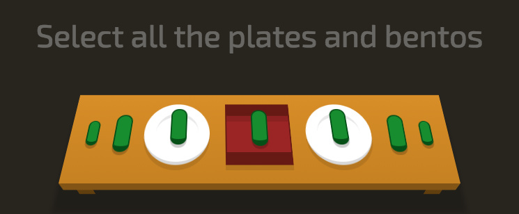

# 选择器

推荐一个 CSS 选择器教学网站，非常有趣。 [CSS Diner](http://flukeout.github.io/)

作者以游戏的形式列举了多个个 CSS 选择器，感兴趣的同学可以尝试一下。

## 一、基本选择器
1. 通配选择器*

## 二、层次选择器

## 三、伪类选择器

## 四、伪元素

## 五、属性选择器

http://www.cnblogs.com/skylar/p/css3-selector.html
http://www.cnblogs.com/webblog/archive/2009/07/07/1518274.html
