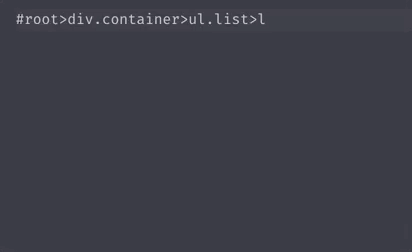

# 快速编写HTML神器 —— Emmet

HTML作为一种结构化的标签式的语言，如果每次编写代码时都要手动输入大于号、小于号等开始、结束标签的话，会导致编码速度降低，同时也会降低写代码的流畅性，最好的办法是只要输入`tag`名字，点击`tab`键自动补全代码。这就是 `Emmet` 最好用的的功能之一 —— `展开缩写`，Emmet以前的名字叫 `Zen Coding`，感觉还是之前的名字霸气，`禅意 coding`。

现在 `Emmet` 已经被多种主流编辑器和IDE中或集成、或提供插件的方式提供用户使用。

## 展开缩写

Emmet使用特定语言来展开HTML代码，类似CSS选择器，写完之后一个`tab`键补全，就可以使其成为完整的HTML代码。

比如：在编辑器中书写 `#root>div.container>ul.list>li*5>a`

```html
<div id="root">
  <div class="container">
    <ul class="list">
      <li><a href=""></a></li>
      <li><a href=""></a></li>
      <li><a href=""></a></li>
      <li><a href=""></a></li>
      <li><a href=""></a></li>
    </ul>
  </div>
</div>
```




