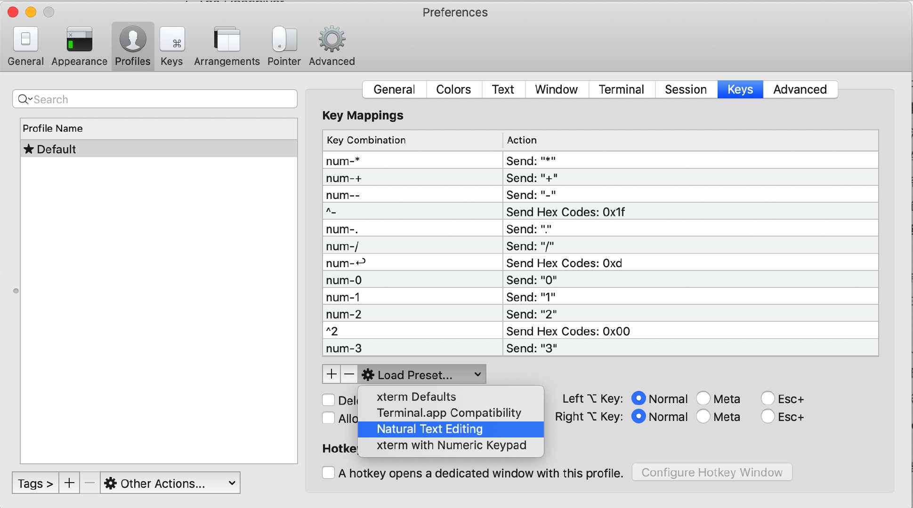

# 安装Mac


## Mac下软件安装神器 brew

```bash
## 安装brew https://brew.sh/
$ brew search
$ brew list
$ brew install xxx
$ brew cask install xxx
$ brew cask install shadowsocksx charles wechat visual-studio-code
```

## 安装on-my-zsh

http://ohmyz.sh/

## zsh关键字高亮插件 zsh-syntax-highlighting

```
brew install zsh-syntax-highlighting
source /usr/local/share/zsh-syntax-highlighting/zsh-syntax-highlighting.zsh
```

## zsh-autosuggestions 自动提示插件

`https://github.com/zsh-users/zsh-autosuggestions/blob/master/INSTALL.md#oh-my-zsh`


## iTerm2启用词语选择

Enable word jumps and word deletion, aka natural text selection

By default, word jumps (option + → or ←) and word deletions (option + backspace) do not work. To enable these, go to "iTerm → Preferences → Profiles → Keys → Load Preset... → Natural Text Editing → Boom! Head explodes"



## iPic

图床工具

## 动图制作工具

GIPHY CAPTURE


## nvm

```bash
指定默认版本
nvm alias default 11.2.0
```

## npm install xxx报 EACCESS,mkdir错误

~/.npm目录权限问题，

```bash
sudo chown -R $USER:$GROUP ~/.npm
npm cache clean
```


```bash
# 查看配置
$ npm config list
$ npm config list -l

# 设置代理
$ npm config set proxy http://127.0.0.1.8080

# 使用完毕
$ npm config set proxy null
```

## vim 使用


配置 `~/.vimrc` 文件：

```bash
"关闭兼容VI模式（可选项：compatible/nocompatible，若选择了compatible则tab不会转成空格）
set nocompatible
source $VIMRUNTIME/vimrc_example.vim
source $VIMRUNTIME/mswin.vim
"设置鼠标运行模式为WINDOWS模式
behave mswin
"开启语法高亮
syntax enable
"行号和标尺
set number
set ruler
set rulerformat=%15(%c%V\ %p%%%)
set relativenumber                  "设置相对行号
" 状态栏显示目前所执行的指令
set showcmd
" 缩进
set autoindent
set smartindent
" 自动重新读入
set autoread
```

快捷键：

```bash
# 移动光标
# 1. JKLH 分别代表 上下左右

# 编辑模式
# 1. 使用 i 在光标处插入（insert）， 使用 a 在光标后插入（append）


# 复制 和 粘贴
# 1. 将光标置于你想要复制的文字处
# 2. 使用 v 选择字符， V 选择整行
# 3. 移动光标到你要复制的文字结尾处
# 4. 使用 y 复制， d 剪切
# 5. 移动光标到任何你想要粘贴的地方
# 6. 使用 P 粘贴到光标前， p粘贴到光标后
```


# Linux 文件权限


## 查看权限

$ ls -l

-rw-r--r--

共10位，
第一位，表示文件类型，
- 文件
d 目录
l 软链接文件


剩下9个3位一组，
第一组表示u所有者，第二组表示g所有者，第三组表示other所有者。

其中，r代表读，  w代表写， x代表执行


## 修改权限

chomd [选项] 模式 文件名/目录
- 选项
  * -R 递归
- 模式
  * [ugoa] [+-=] [rwx]
  * [mode=421]


```bash
$ chmod u+x file1

$ chmod g+w,o+w file2

$ chmod a=rwx filex

```

以上这种方式不够简便，在实际应用中很少使用。

推荐使用权限的数字表示方式：
r -- 4
w -- 2
x -- 1

rwxr-xr-x
7  5  5   只读权限

rw-r--r--
6  4  4    普通文件权限


rwxrwxrwx
7  7  7    最高权限

## 常用命令

```bash
# 查看硬盘使用空间
$ du -d 1 -h
```


## 实现终端命令行CLI翻墙效果

配置：
修改`~/.zshrc`配置文件，增加以下2行

```bash
# proxy list
alias proxy='export all_proxy=socks5://127.0.0.1:1080'
alias unproxy='unset all_proxy'
```

测试：

```bash
# 未运行 proxy 命令前
$ curl cip.cc
IP	: 58.247.11.227
地址	: 中国  上海
运营商	: 联通

数据二	: 上海市 | 联通

数据三	: 中国上海上海市 | 联通

URL	: http://www.cip.cc/58.247.11.227

# 运行 proxy 命令
$ proxy
$ curl cip.cc
IP	: 3.16.15.181
地址	: 美国  美国

数据二	: 美国 | Amazon EC2服务器

数据三	: 美国华盛顿 | 亚马逊

URL	: http://www.cip.cc/3.16.15.181

# 翻墙成功，尽情的npm install吧
```


## 常用Linux命令

### scp
```bash
# 登录跳板机
$ jump
$ mkdir /tmp/hybird
# 回到本机，scp到远程服务器的tmp目录
$ scp your_local_file root@172.19.15.8:/tmp/workspace
$ ssh root@172.19.15.8
```


### 查看size
```bash
# 查看目录大小：
$ du -h -d 1 ~/gitlab
# 查看磁盘容量
$ df -h
```

## 常用git命令


### 删除分支
```bash
# 删除远程分支的方法：
$ git push origin --delete feature/test1
$ git push origin :feature/test1

删除本地分支：
$ git branch -d feature/test
```


```bash
# 删除未track的目录以及文件
$ git clean -fd

# 强制清除本地改动
$ git checkout -f

# 把别的commit id 合并到当前分支
$ git cherry-pick [commit id]
```


