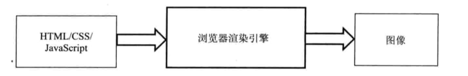
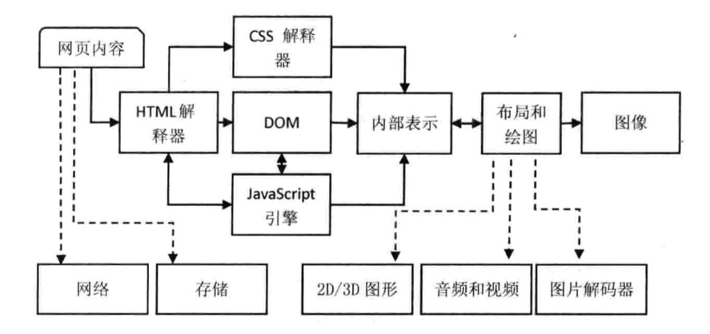

# WebKit技术内幕

- 2003年，苹果发布了 Safari 浏览器，并在2005年发起了新的开源项目 WebKit（它是 Safari 浏览器的内核）。
- 2008年，Google 以苹果开源项目 WebKit 作为内核，创建了一个新的项目 Chromium. 这也就是说 Chromium 使用了同 Safari 一样的浏览器内核（这一说法大体上是正确的，实际上也还有很多不同）。

浏览器有一个重要的模块： **渲染引擎**。浏览器的渲染引擎就是能够将 HTML/CSS/JavaScript 文本及其相应的资源转换成图像结果的模块，入图所示：

暂时先把转换的过程看成一个黑盒，其中的细节就是前端工程师应该学习的重点。

浏览器渲染引擎主要包括：

- HTML解释器
  > 解释 HTML 文本的解释器，主要作用是将 HTML 文本即使成 DOM（文档对象模型）树，DOM是一种文档的表示方法
- CSS解释器
  > 层叠样式表的解释器，它的作用是为 DOM 树种的各个元素对象计算出样式信息，从而为计算最后网页的布局提供基础设施
- 布局 layout
  > 在 DOM 创建之后，WebKit 需要将其中的元素对象同样式信息结合起来，计算它们的大小位置等布局信息，行成一个能够表示这所有信息的内部表示模型
- JavaScript 引擎
  > 使用 JavaScript 代码可以修改网页的内容，也能够修改 CSS 的信息，JavaScript 引擎能够解释 JavaScript 代码并通过 DOM 接口和 CSSOM 接口来修改网页的内容和样式信息，从而改变渲染的结果
- 绘图
  > 使用图形库将布局计算后的各个网页的节点绘制成图像结果。

