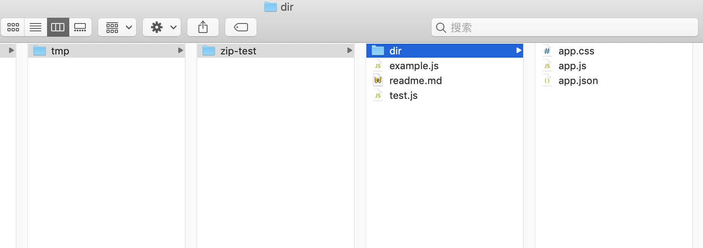
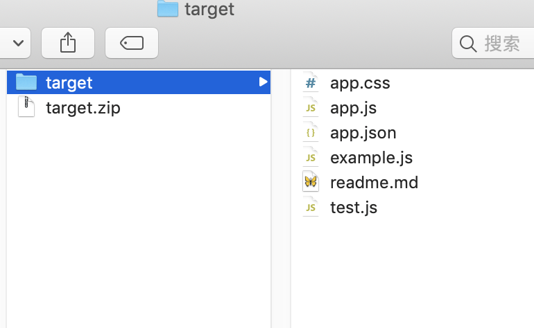

# zip

## zip 命令格式

`zip [--options] target.zip your_file_dir`

其中常用的参数有：

`-r`: 递归的压缩所有子目录

`-X`: 排除隐藏文件，比如`.DS_Store`

`-q`: 不输出log

`-j`: 去掉递归目录名称`/usr/local/bin`这种格式，全部打平到一个目录


```bash
$ zip -r ~/workspace/tmp/target.zip ~/workspace/tmp/zip-test/
```




```bash
$ zip -rj ~/workspace/tmp/target.zip ~/workspace/tmp/zip-test/
```



可以看出来，加上`-j`参数后，所有的目录都被去掉了，所有的文件都平铺在根目录下。

这样不太好，所以一般会先`cd`进入某个目录，再执行`zip path/to/target.zip *`生成压缩zip文件。

